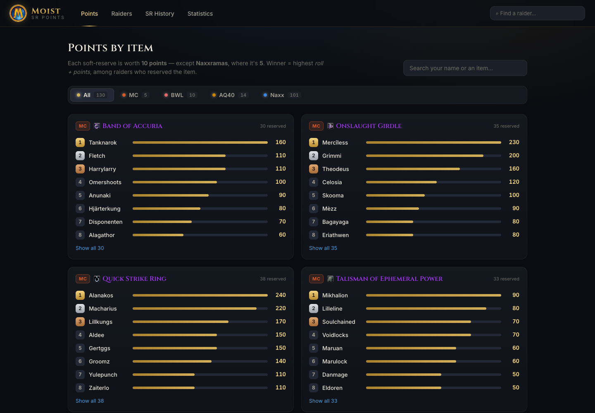

# Moist — SR Points

A modern, WoW-flavoured website for the guild's accumulative soft-reserve (SR)
points system. It reads the guild's SQLite database **live, in the browser** —
so once the site is hosted, **there's no build or deploy to update it.** When the
database changes, the site follows.

No backend, no database server, no paid services.



---

## How it stays up to date (the important part)

The site loads the database straight from **Yulefuel's `moistdb` repo** over
[jsDelivr](https://www.jsdelivr.com)'s free CDN, and runs it in the browser.

```
Yule updates moistdb.sqlite  ─push→  github.com/yulefuel-moist/moistdb
                                             │  (served via jsDelivr CDN)
                                             ▼
                       the live site reads it in the browser — no rebuild
```

So **updating the data is just Yule's normal workflow** — update the database,
push it to that repo. Nothing else. The site picks it up automatically.

**Freshness (near real-time):** the app asks the GitHub API for the latest commit
to the database, then loads the CDN copy *pinned to that exact commit*
(`…moistdb@<commit>/…`). A pinned commit is served immediately, so a push shows up
within a minute — no waiting on jsDelivr's ~12h branch cache, and nothing for Yule
to set up. If the GitHub API is unavailable (e.g. rate-limited), it falls back to
the plain branch URL (and you can force that with the jsDelivr purge URL:
`https://purge.jsdelivr.net/gh/yulefuel-moist/moistdb@main/moistdb.sqlite`).

Pointing at a different database is a one-line change — see
[Configuration](#configuration).

---

## Hosting the site (one-time, by whoever owns it)

Because the data loads at runtime, you only ever build/deploy the app itself —
and only when the *code* changes, which is rare. Two ways:

- **Netlify (recommended):** connect this repo (New site → import from Git).
  `netlify.toml` is already set up. Done — it's live, and it keeps itself updated
  from the database with no further action.
- **Anything static:** run `npm run build` once and host the `dist/` folder
  (Netlify drag-and-drop at <https://app.netlify.com/drop>, GitHub Pages, your
  own server…). It uses relative paths, so it works at any domain or subpath.

That's it. From then on, the data updates handle themselves.

---

## See it running locally

Only needed to change the UI, or to try it on your machine. Requires
[Node.js](https://nodejs.org) 20+ (`node -v` to check).

```bash
npm install     # first time only
npm run dev     # open the link it prints, e.g. http://localhost:5173
```

`npm run dev` copies the project's `moistdb.sqlite` into `public/` so it loads
that local copy (you can work offline). Build/preview the production version:

```bash
npm run build   # builds to dist/
npm run preview # serves dist/ at http://localhost:4173
```

Whichever database it ends up using is printed in the browser console
(**F12 → Console**), e.g. `[Moist] database source: remote → …`.

---

## Configuration

Where the app reads the database from is decided in **`src/config.js`** /
`src/lib/loadDb.js`, in this order:

1. **Override** — `?db=<url>` in the page URL, or a `VITE_DB_URL` set at build
   time. Handy for testing: `yoursite.com/?db=https://.../other.sqlite`.
2. **Local file** — a `moistdb.sqlite` served next to the app (this is what
   `npm run dev` uses, and you can drop one next to a hosted copy to override the
   remote). Skipped if it isn't a real SQLite file.
3. **Remote (default)** — Yulefuel's repo via jsDelivr.

To change the default source permanently, edit `REMOTE_DB_URL` in
`src/config.js`. Any database works as long as it has the same shape (the
`v_SRPoints` / `v_SRData` views and the `Items` / `Characters` / `SRData` /
`SRPages` / `Raids` tables).

---

## Drop rates & "Guild luck"

The **Guild luck** panel on the Statistics page compares how often items have
actually dropped against how often they *should* have, given how many times each
raid has been cleared. That needs a drop rate per item — and those aren't in the
database (and there's no reliable free source to pull them automatically), so
they live in **`src/data/dropRates.js`**, which you fill in.

- Every tracked item is already listed there; you just replace each `null` with
  the item's drop chance as a decimal (15% → `0.15`), read off Wowhead's
  "Dropped by" section.
- Items left as `null` are simply excluded. The panel shows how many items it's
  based on and stays hidden/soft until at least one rate is filled in.
- These are rough, for-fun numbers (shared loot tables, multiple bosses…), so
  the panel labels the luck as approximate. It's a fun indicator, not science.

---

## Troubleshooting — if something isn't working

These are the common snags and their fixes.

> 💡 For anything in the browser, open **F12 → Console** to see the real error.

**The page is blank / stuck on "Summoning data…"**
It's failing to load the database. Open F12 → Console. Most likely: no internet,
or the database URL is wrong / the file was moved or renamed in the source repo.
Check the URL in `src/config.js` points at a file that exists.

**It loads, but shows old data**
jsDelivr is serving a cached copy. Open the purge URL once to refresh it:
`https://purge.jsdelivr.net/gh/yulefuel-moist/moistdb@main/moistdb.sqlite`
then reload (Ctrl+Shift+R / Cmd+Shift+R).

**"This database is missing the expected views (v_SRPoints / v_SRData)"**
The database that loaded isn't the one your normal tool produces (those views are
built into it). Make sure the source repo has the right file.

**"The downloaded file isn't a valid SQLite database"**
The file at the source URL is corrupted or isn't actually a database. Confirm it
opens in <https://beta.sqliteviewer.app> and re-upload it to the source repo.

**Item icons / hover tooltips don't show**
Those come from Wowhead's script (needs internet, can be blocked by ad blockers).
Cosmetic only — everything else still works.

**`node` / `npm` not recognized** (only relevant for local dev / building)
Install [Node.js](https://nodejs.org) (LTS), then **close and reopen** the
terminal. `node -v` should print v20+.

**Leeroy shows up too much / I want him gone**
`src/components/Leeroy.jsx` → set `ENABLED = false` (or lower `CHARGE_ODDS`).
See [Easter eggs](#easter-eggs-).

Still stuck? Copy the error from the F12 console and send it to **Cedrik/Drikkle**.

---

## How it works (under the hood)

- The app loads **[sql.js](https://sql.js.org)** — SQLite compiled to
  WebAssembly — and runs the database directly in the browser. The `.wasm` is
  bundled with the app (not fetched from a third party); only the database file
  comes over the network.
- It reads the database's **own views**, so all the SR-points rules live in one
  place (the database), never duplicated in code:
  - `v_SRPoints` — current standings (already excludes rewarded items, inactive
    characters, and SRs placed before an item existed).
  - `SRData` / `v_SRData` — the full soft-reserve history.
- The query + shaping logic is `src/lib/shapeData.js`; the browser loader is
  `src/lib/loadDb.js`.
- The footer shows how current the data is: the latest raid date in the database,
  plus — when reachable — how long ago the database file was last committed (via
  the GitHub API; it degrades gracefully if that's blocked or rate-limited).
- Nice coincidence in the schema: `Items.item_id` is the **Wowhead item id**, so
  every item links to Wowhead with live icons + tooltips, for free.
- **Trade-off:** the first visit downloads the WASM engine (~0.65 MB) and the
  database (~0.5 MB). Both are small and cached, and it buys the "zero build,
  zero deploy, always current" property. Worth it for a hobby site.

### Project layout

```
src/                  the React app (UI)
src/config.js         WHERE the database is loaded from (edit this to repoint)
src/identity.js       the no-login "who am I" (My Page), saved in localStorage
src/lib/loadDb.js     loads sql.js + fetches the database in the browser
src/lib/shapeData.js  turns the database into the data the app renders
src/lib/odds.js       win-the-roll probabilities (points + d100)
src/index.css         all styling; theme colours are CSS variables at the top
moistdb.sqlite        a local snapshot, used only for `npm run dev` (offline)
netlify.toml          hosting config for the app itself
```

---

## The site's pages

- **My Page** — pick your character once (no login — saved on the device) and get
  a personal page: your points, your SR history, and **Best bets** — your chance
  to win the roll on each item you have points on. Your rows are highlighted
  across the whole site, and the header shows who you are. Handles brand-new
  raiders with no points yet. *(Win-odds assume everyone with points contests the
  item, so they're a worst-case — see the note on that panel.)*
- **Points** (the home page) — every tracked item, grouped and ranked with
  point bars. Defaults to **all raids** and is searchable, so a raider can just
  type their name to see their items; the raid buttons (All / MC / BWL / AQ40 /
  Naxx) filter down. Items link to Wowhead. Each SR is worth 10 points, except
  Naxxramas where it's 5.
- **Raiders** — searchable directory; each raider has a profile with points by
  item and their full personal SR history (a quick "just show me my stuff").
- **SR History** — the complete log, sortable by any column (including raider
  name) and filterable by raider/item and raid.
- **Statistics** — the fun overview: guild stats, SRs by raid, weekly activity,
  most-contested items, point leaders, a **Hall of Fame** (superlatives — loot
  goblin, luckiest/unluckiest by wins-per-SR, biggest stockpile, etc.), a
  **Recent loot** feed of who won what, and **Guild luck** (drops vs. expected —
  see below).

---

## Easter eggs 🐔

Leeroy Jenkins is in here. It's all in `src/components/Leeroy.jsx`, configurable
via three constants at the top:

| What | How to trigger | Notes |
|------|----------------|-------|
| **The charge** | Random, on page load | Leeroy sprints *along* a random on-screen bar or line of text, trailing chicken. |
| **The battle cry** | Type `leeroy` anywhere | Full-screen "LEEEEEROY JENKINS!", raining chicken, screen shake. |
| **Force it (for testing)** | Add `?leeroy=charge` or `?leeroy` to the URL | e.g. `yoursite.com/?leeroy=charge` |

```js
const ENABLED = true;      // set false to turn the whole thing off
const CHARGE_ODDS = 1 / 20; // chance per page load of the random charge
const CODE = "leeroy";     // the word you type for the battle cry
```

It respects `prefers-reduced-motion`.

---

## Customising the look

No CSS framework, no chart library — just plain CSS and hand-rolled SVG. Theme
colours (the WoW gold, frost blue, per-raid colours, dark surfaces) are all CSS
variables at the very top of `src/index.css`. Change them there and the whole
site follows.
