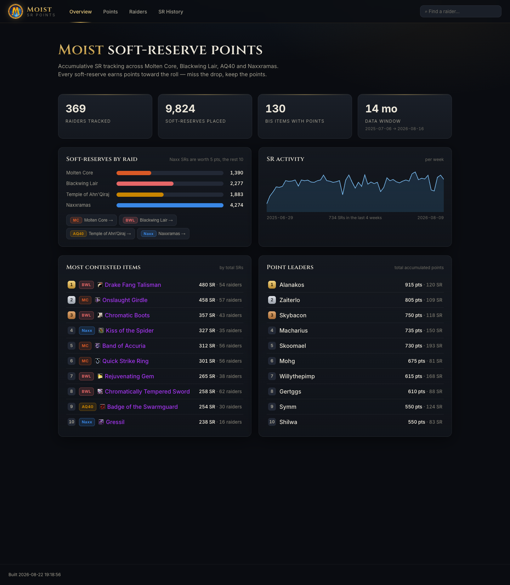

# Moist — SR Points

A modern, WoW-flavoured website for the guild's accumulative soft-reserve (SR)
points system. It reads the guild's SQLite database (`moistdb.sqlite`) and
**builds into a plain folder of static files** that you can host anywhere for
free — Netlify, GitHub Pages, your own web server, whatever.

There is no backend, no database server, and no paid services. You run one
command to generate the site, then you own the output.



---

## What this repo is

Think of this repo as a **site generator**. You give it a `moistdb.sqlite`, it
gives you back a `dist/` folder = the finished website.

```
moistdb.sqlite  ──▶  npm run build  ──▶  dist/  ──▶  host it anywhere
 (your database)     (one command)      (static     (Netlify / GitHub
                                          website)     Pages / any server)
```

The typical flow: **Cedrik/Drikkle** maintains this generator repo; **Yulefuel** clones
it, drops in the real database, builds, and publishes the result to his own
host. You never have to touch the code to update the data.

---

## See it running locally (start here)

Fastest way to look at the site on your own machine — great for a first look or
demoing it to someone. Requires [Node.js](https://nodejs.org) 20+ (`node -v` to
check).

```bash
npm install     # first time only
npm run dev     # then open the link it prints, e.g. http://localhost:5173
```

That starts a live preview (it even reloads when you change something) using
whatever `moistdb.sqlite` is in the folder. Press `Ctrl+C` to stop.

Want to test the actual production build (the exact files you'd host)?

```bash
npm run build   # creates the dist/ folder
npm run preview # serves dist/ at http://localhost:4173
```

> ⚠️ You can't just double-click `dist/index.html` — a page opened from a
> `file://` path isn't allowed to load the data file. Use `npm run preview`
> (or any static server, e.g. `npx serve dist`).

> 🔗 **Want to share a link without the other person installing anything?** Run
> `npm run build`, then drag the `dist/` folder onto <https://app.netlify.com/drop>
> — you'll get a public URL in seconds.

---

## Quick start (build the site from your database)

You need [Node.js](https://nodejs.org) 20 or newer installed (one-time). Check
with `node -v`. Everything else is just running commands in this folder.

1. **Get the repo** — clone it, or download it as a ZIP and unzip:
   ```bash
   git clone <this-repo-url>
   cd moist
   ```

2. **Drop in your database.** Put your `moistdb.sqlite` in the project root,
   replacing the one that's there. (This is the same file you drag into
   sqliteviewer.app.)

3. **Install dependencies** — one time only:
   ```bash
   npm install
   ```

4. **Build the site:**
   ```bash
   npm run build
   ```
   This reads `moistdb.sqlite`, generates the data, and produces a **`dist/`
   folder** containing the complete website.

5. **Host the `dist/` folder** anywhere (see below). Done.

To update later, just replace `moistdb.sqlite` and run `npm run build` again.

> 💡 **Preview before publishing:** run `npm run dev` and open the link it
> prints (http://localhost:5173). It live-reloads while you look around.

---

## Hosting the `dist/` folder

The build output is completely self-contained and uses relative paths, so it
works at a root domain *or* a subpath. Pick whatever you like:

- **Netlify (drag & drop):** go to <https://app.netlify.com/drop> and drag the
  `dist/` folder onto the page. Instant free URL. To update, drag the new
  `dist/` again.
- **GitHub Pages:** push the contents of `dist/` to a repo (or a `gh-pages`
  branch) and enable Pages. Works out of the box (routing is hash-based, so no
  extra config needed).
- **Your own web server:** copy `dist/` and serve it as static files. No Node,
  no database, nothing to run on the server.

### Optional: fully automatic rebuilds on Netlify

If you'd rather not run the build yourself, connect **this repo** to Netlify
(New site → import from Git). `netlify.toml` is already set up so Netlify runs
the build for you. Then updating the site is just: replace `moistdb.sqlite` in
the repo (you can even drag-drop it in the github.com web UI) and push — Netlify
rebuilds automatically in about a minute. This is the "no local tools" path.

---

## How it works (under the hood)

- **`scripts/generate.mjs`** reads `moistdb.sqlite` and writes
  `public/data/data.json` — the single file the app loads. It uses
  [sql.js](https://sql.js.org) (a pure-WebAssembly SQLite engine), so there's
  nothing to compile and it runs the same on every machine — no `sqlite3` CLI,
  no Python, no native modules.
- It reads the database's **own views**, so the SR-points rules live in one
  place (the database), never duplicated in code:
  - `v_SRPoints` — the current standings. Already handles excluding rewarded
    items, inactive characters, and SRs placed before an item existed.
  - `SRData` / `v_SRData` — the full soft-reserve history.
- Nice coincidence in the schema: `Items.item_id` is the **Wowhead item id**, so
  every item links to Wowhead with live icons + tooltips, for free.
- `npm run build` = `generate` then `vite build`. `npm run dev` regenerates the
  data first, then starts the live-reload preview.

### Project layout

```
moistdb.sqlite        the database you drop in (source of truth)
scripts/generate.mjs  database -> public/data/data.json
src/                  the React app (UI)
src/index.css         all styling; theme colours are CSS variables at the top
public/               static assets (logo, generated data.json)
netlify.toml          config for the optional auto-rebuild-on-Netlify path
dist/                 build output (created by `npm run build`) — host this
```

---

## The site's pages

- **Overview** — guild stats, SRs by raid, weekly activity, most-contested
  items, and point leaders.
- **Points** — per-raid, grouped by item, ranked with point bars. Filter by
  item or player. Items link to Wowhead.
- **Raiders** — searchable directory; each raider has a profile with points by
  item and their full personal SR history (a quick "just show me my stuff").
- **SR History** — the complete log, sortable by any column (including raider
  name) and filterable by raider/item and raid.

---

## Easter eggs 🐔

Yes, Leeroy Jenkins is in here. It's all in `src/components/Leeroy.jsx`, and it's
fully configurable via three constants at the top of that file:

| What | How to trigger | Notes |
|------|----------------|-------|
| **The charge** | Random, on page load | Leeroy sprints *along* a random on-screen bar or line of text, trailing chicken. |
| **The battle cry** | Type `leeroy` anywhere | Full-screen "LEEEEEROY JENKINS!", raining chicken, screen shake. |
| **Force it (for testing)** | Add `?leeroy=charge` or `?leeroy` to the URL | e.g. `yoursite.com/?leeroy=charge` |

Config at the top of `src/components/Leeroy.jsx`:

```js
const ENABLED = true;      // set false to turn the whole thing off
const CHARGE_ODDS = 1 / 20; // chance per page load of the random charge
                            // (use 1 while testing to see it every load)
const CODE = "leeroy";     // the word you type for the battle cry
```

It respects `prefers-reduced-motion`, so anyone who's asked their OS to reduce
motion won't get the animations.

---

## Customising the look

No CSS framework, no chart library — just plain CSS and hand-rolled SVG, so it's
approachable. Theme colours (the WoW gold, frost blue, per-raid colours, dark
surfaces) are all CSS variables at the very top of `src/index.css`. Change them
there and the whole site follows.
